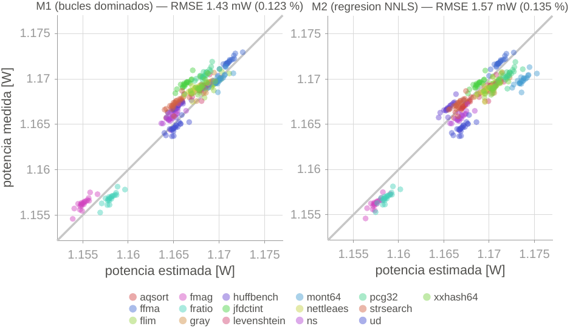
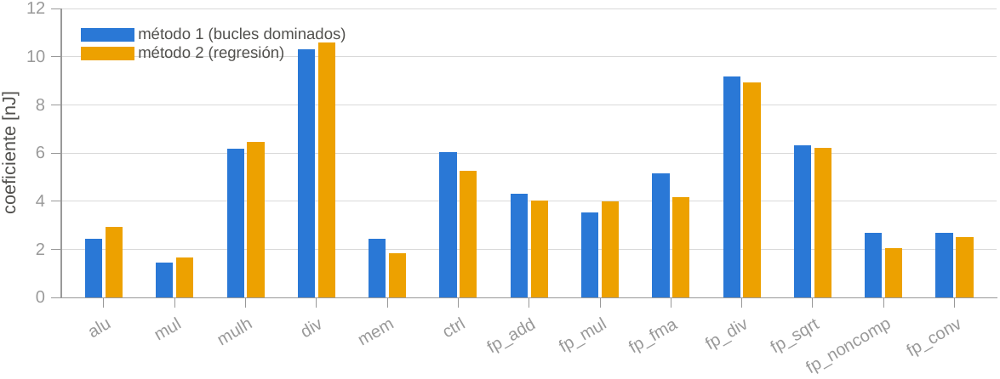

# Datos de caracterización y validación

Datos finales del TFG: estimación de consumo por conteo de instrucciones en el
núcleo CV32E40P (PULPissimo / Nexys A7), con dos métodos de caracterización.

- **M1 — bucles dominados:** una categoría por lazo, aislada contra el idle.
- **M2 — regresión (NNLS):** programas mixtos, modelo diferencial (base α +
  sobrecosto por categoría + término de stall), intercepto ajustado y **mul** como
  referencia; multi-ciclo plegado a energía por instrucción.

## Validación — medido vs. predicho

20 tandas de validación (cargas *held-out*: BEEBS + kernels propios fp), potencia
estimada contra la medida por el banco (INA228). La bisectriz es el acierto perfecto.



| método | RMSE | error (RMSE / P̄) |
|---|---|---|
| **M1** (bucles dominados) | 1.43 mW | **0.123 %** |
| **M2** (regresión NNLS)   | 1.57 mW | **0.135 %** |

El error sobre la potencia total (~1.17 W, 99 % estática) es del orden de 0.12 %;
sobre la componente **dinámica** (~22 mW, lo que el modelo realmente predice)
equivale a ~5–8 %.

## Comparación de coeficientes M1 vs. M2

Energía por instrucción de cada categoría, por los dos métodos independientes.



Los dos métodos coinciden en las categorías dominantes (div ≈ 10.3/10.6 nJ, mulh,
fp_div, fp_sqrt), lo que valida cruzadamente el modelo: M1 las mide aisladas, M2
las despeja de mezclas reales, y dan lo mismo.

## Estructura

```
data/
├── characterization/
│   ├── loops/            # M1: data.csv (crudo), campaigns/ (por tanda), coefficients.csv
│   └── regression/       # M2: idem
└── validation/           # 20 tandas (M1 + M2)
```

Los `.pdf` (`validacion.pdf`, `coef_barras.pdf`) son las versiones vectoriales
para el documento.
