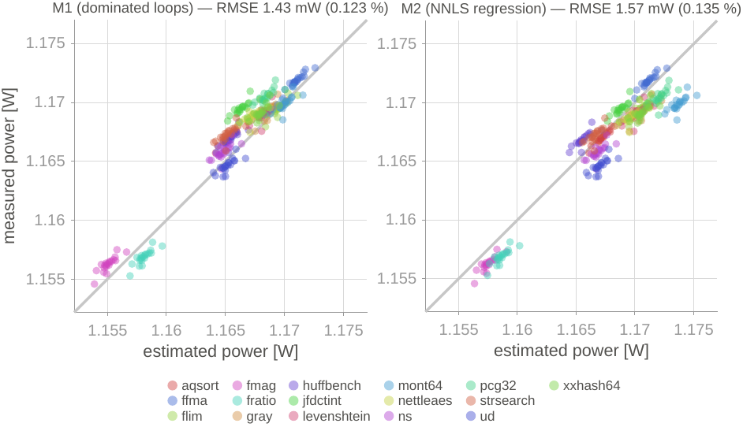
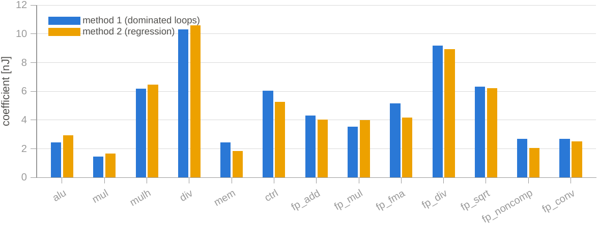

# Characterization and validation data

Final data of the project: instruction-count-based energy estimation on the
CV32E40P core (PULPissimo / Nexys A7), with two characterization methods.

- **M1 — dominated loops:** one category per loop, isolated against idle.
- **M2 — regression (NNLS):** mixed programs, differential model (base α +
  per-category overhead + stall term), fitted intercept and **mul** as the
  reference; multi-cycle categories folded into per-instruction energy.

## Validation — measured vs. predicted

20 validation runs (held-out loads: BEEBS + custom fp kernels), estimated power
against the power measured by the bench (INA228). The diagonal is the perfect fit.



| method | RMSE | error (RMSE / P̄) |
|---|---|---|
| **M1** (dominated loops) | 1.43 mW | **0.123 %** |
| **M2** (NNLS regression) | 1.57 mW | **0.135 %** |

The error on total power (~1.17 W, 99 % static) is about 0.12 %; relative to the
**dynamic** component (~22 mW, what the model actually predicts) it is ~5–8 %.

## M1 vs. M2 coefficient comparison

Per-instruction energy of each category, from the two independent methods.



Both methods agree on the dominant categories (div ≈ 10.3 / 10.6 nJ, mulh, fp_div,
fp_sqrt), which cross-validates the model: M1 measures them in isolation, M2 solves
for them from real mixed programs, and they land on the same values.

## Layout

```
data/
├── characterization/
│   ├── loops/            # M1: data.csv (raw), campaigns/ (per run), coefficients.csv
│   ├── regression/       # M2: data.csv (raw), campaigns/ (per fit), coefficients.csv
│   ├── thermal/          # idle power vs die temperature sweep
│   └── Fetch/            # instruction-fetch energy sweep (+ the script that took it)
└── validation/           # 20 runs, one M1 file + one M2 file each
```

The `.pdf` files (`validation.pdf`, `coefficients.pdf`) are the vector versions for
the document.

---

# Data dictionary

Everything below documents the CSV columns, their units, and how each file is
produced, so the data can be reused directly.

## How the data is produced

Every measurement comes from the same setup: the PULPissimo SoC with a **CV32E40P**
core at **10 MHz**, synthesised on the **Nexys A7-100T (XC7A100T)** FPGA.

For each run:

1. A bare-metal firmware runs on the core. The on-chip **instruction classifier**
   accumulates one 64-bit counter per category at retire time (gated by the core's
   `minstret` pulse, so speculative/cancelled instructions are not counted).
2. The core raises a GPIO to open a measurement **window**; the bench (an **INA228**
   with a 15 mΩ high-side shunt, read by an **ESP32**) averages voltage·current over
   that window and reports the mean power to the host over Wi-Fi.
3. When the window closes, the host reads the classifier CSRs over JTAG
   (OpenOCD + GDB). Counters and power are aligned by the window.
4. Die temperature is read from the FPGA's on-chip **XADC** sensor.

So **one CSV row = one run**: the instruction counters and the measured power belong
to the same window.

## Instruction-count columns (shared)

These columns appear in every raw and validation file (`*/data.csv`,
`validation/*.csv`). The 13 categories are the classifier's outputs.

| column | unit | meaning |
|---|---|---|
| `date` | local timestamp | when the run finished |
| `n_alu`, `n_mul`, `n_mulh`, `n_div`, `n_mem`, `n_ctrl` | count | retired integer instructions per category |
| `n_fp_add`, `n_fp_mul`, `n_fp_fma`, `n_fp_div`, `n_fp_sqrt`, `n_fp_noncomp`, `n_fp_conv` | count | retired FP instructions per category |
| `c_div` | cycles | cycles the serial divider was busy (its latency is operand-dependent) |
| `n_fetch` | bytes | instruction footprint: range of instruction addresses touched (feeds the optional fetch term; the SoC has no I-cache) |
| `mcycle` | cycles | total clock cycles in the window (`mcycle` CSR delta) |
| `n_stall` | cycles | non-retiring cycles ≈ `mcycle` − (retired instructions): multi-cycle latency + pipeline bubbles |
| `P_meas_W` | W | mean power measured by the bench over the window |
| `T_s` | s | window duration (wall time; equals `mcycle` / 10 MHz) |
| `temp_C` | °C | die temperature (XADC) during the run |

## `characterization/loops/data.csv` — M1 raw

Dominated-loop runs (one category per loop). Shared columns above, plus:

| column | unit | meaning |
|---|---|---|
| `category` | — | dominated category of the loop, or `idle` |
| `rep` | — | repetition index of that category |

## `characterization/regression/data.csv` — M2 raw

Mixed-workload runs. Shared columns above, plus:

| column | unit | meaning |
|---|---|---|
| `program` | — | workload name; suffix `_d60` / `_d30` = 60 % / 30 % duty cycle (intensity sweep) |

## `coefficients.csv` (both methods)

Long format: `parameter, coef, unit`. Rows:

| `parameter` | unit | meaning |
|---|---|---|
| `P_idle` | W | session idle baseline, measured at rest (`wfi`) |
| `T_idle` | °C | die temperature during that idle measurement |
| `b0` | W | **M2 only** — fitted regression intercept (the model's static baseline) |
| `alu` … `fp_conv` | J/instr | energy per instruction of the category |
| `stall` | J/cycle | **M2 only** — energy per non-retiring cycle |

For the multi-cycle categories (`div`, `mulh`, `fp_div`, `fp_sqrt`) the per-instruction
energy already **folds in** their latency, so both methods' coefficients are directly
comparable.

- **M1**: `e_i = (P_cat − P_idle)·T / n_i`, averaged over repetitions and campaigns.
- **M2**: differential NNLS (shared base α + per-category overhead + a stall term),
  with `mul` as the reference category and a fitted intercept `b0`. The header of each
  per-fit file carries the number of points `n` and the fit `R²`.

`campaigns/` holds one coefficients file per individual characterisation run, **before**
averaging (loops: named by timestamp; regression: the intercept-fit backups
`coeficientes_intercept_N`). The top-level `coefficients.csv` is their average and the
one used by the model.

## `validation/*.csv`

Two files per run — `validacion_bucles_*` (M1) and `validacion_regresion_*` (M2) —
sharing identical counters; only the coefficients and the prediction differ. Shared
instruction-count columns, plus:

| column | unit | meaning |
|---|---|---|
| `method` | — | `bucles` (M1) or `regresion` (M2) |
| `program` | — | held-out kernel (BEEBS + custom FP), never used for calibration |
| `P_pred_W` | W | power predicted by the model |
| `err_pct` | % | `100·(P_pred − P_med) / P_med` |

## `characterization/thermal/pidle_temp.csv`

Idle-power vs temperature sweep, source of the ≈2.9 mW/°C baseline drift.

| column | unit | meaning |
|---|---|---|
| `time` | HH:MM:SS | sample time |
| `temp_C` | °C | die temperature (XADC) |
| `P_idle_W` | W | idle power measured at that temperature |

## `characterization/Fetch/barrido_fetch.csv`

Instruction-fetch energy sweep: the same loop compiled at growing code sizes, to
isolate the energy of fetching from L2 (no I-cache). `barrido_fetch.py` is the script
that produced it.

| column | unit | meaning |
|---|---|---|
| `kb` | KiB | program (code) size |
| `range_bytes`, `n_fetch` | bytes | instruction footprint |
| `coef_nJ` | nJ | estimated fetch energy coefficient at that footprint |
| `dP_mW` | mW | extra power over the reference loop |
| `cyc_ctrl` | cycles | cycles per `ctrl` instruction in the loop |
| `ctrl_pct` | % | share of `ctrl` instructions |
| `n_ctrl` | count | retired `ctrl` instructions |
| `T_s` | s | window duration |
